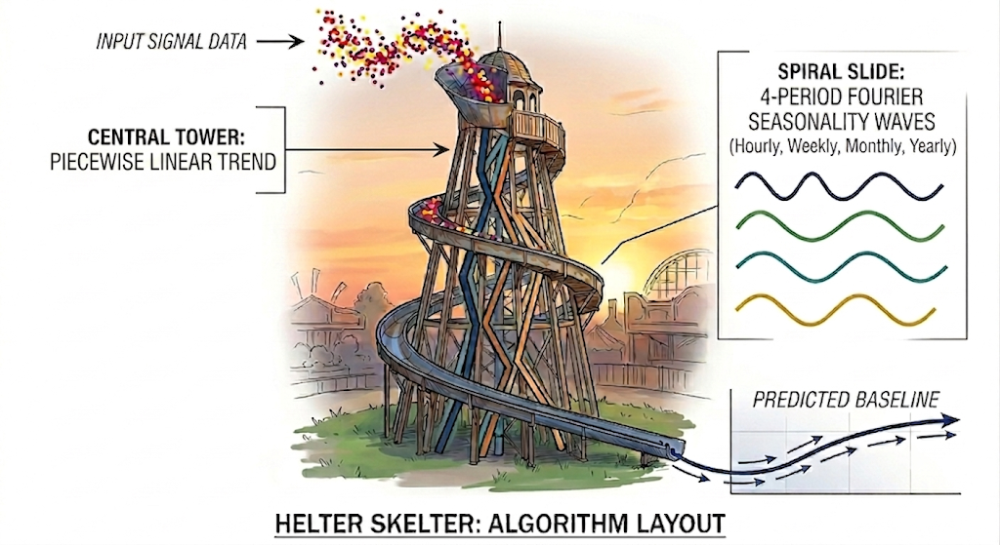
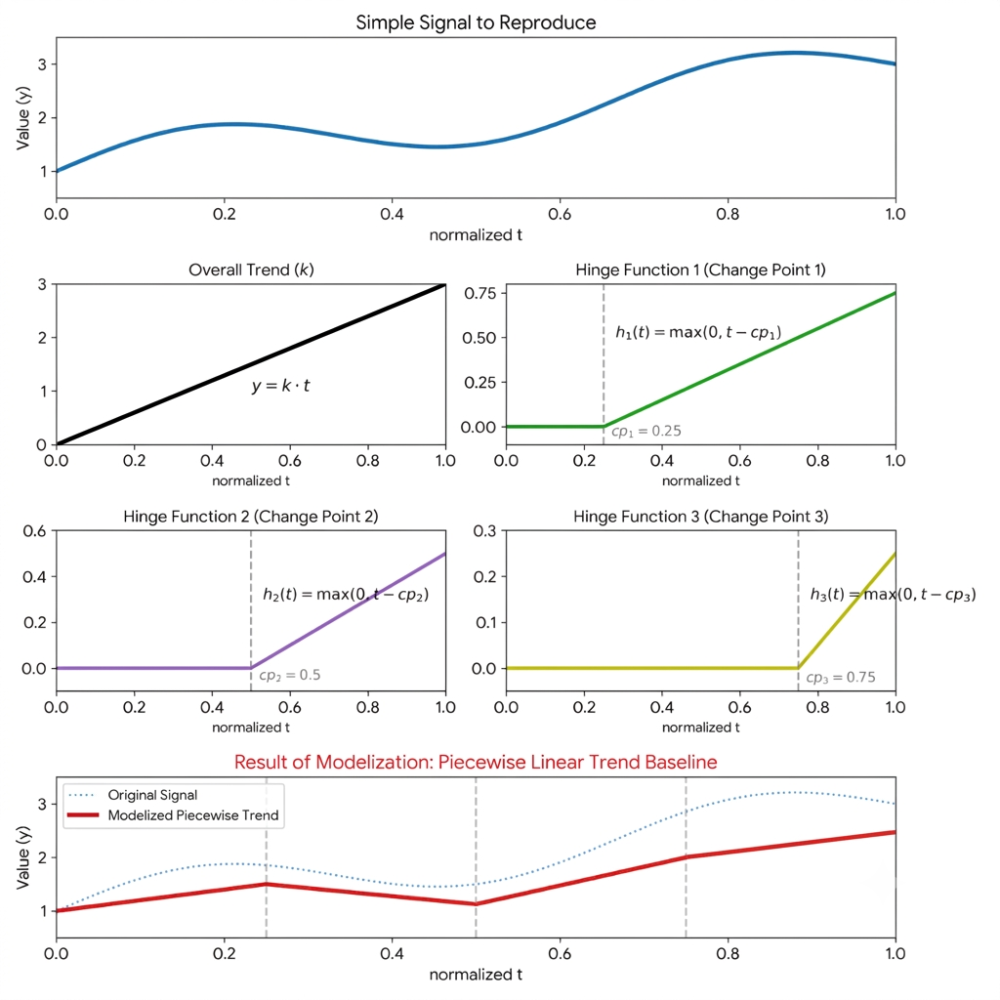
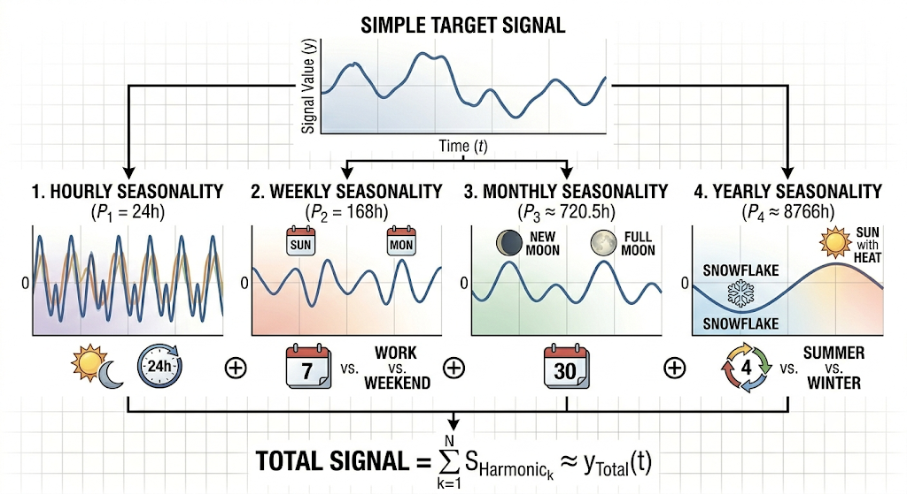
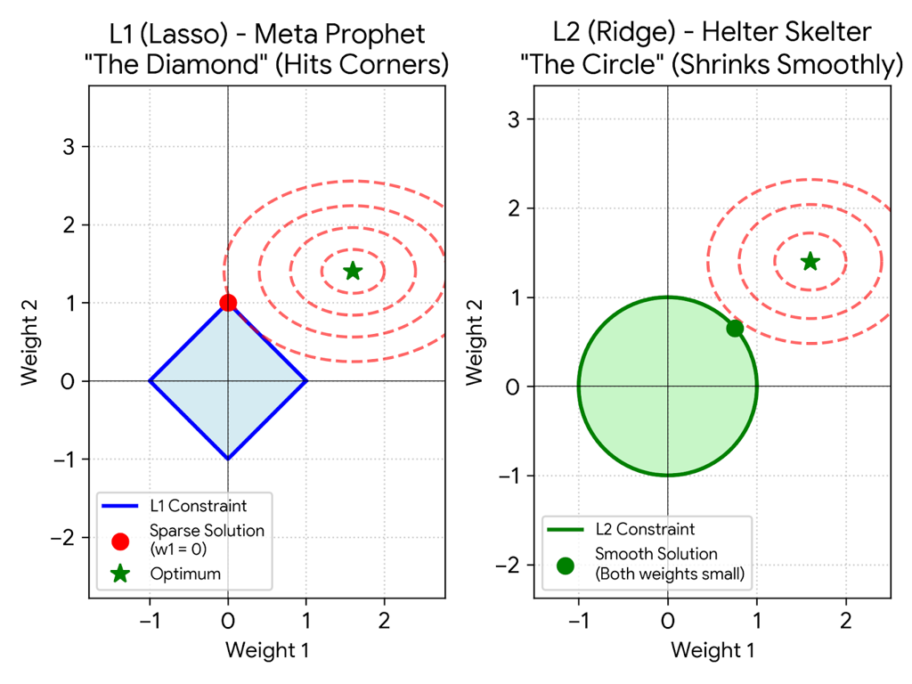

# Mathematical Foundations

## Overview

Helter Skelter models a time series as a fully **additive decomposition** of:

- A trend component
- Multiple seasonal components
- Noise

$y(t) = g(t) + s(t) + penalty$

---

## Conceptual View

The name *Helter Skelter* reflects the algorithm’s structure:

- A **central evolving trend** (like a tower)
- Wrapped with **multiple seasonal waves** (like a spiral slide)

---

## Trend Component — Piecewise Linear Model

Helter Skelter models the trend using a **piecewise linear function**:

$g(t) = k \cdot t + \sum_{i=1}^{N} \delta_i \cdot h_i(t)$

Where:

- k: base slope
- t: normalized time
- N: number of changepoints
- $\delta_i$: slope adjustments
- $h(t)$: hinge functions

---

### Hinge Functions

Each hinge function is defined as:

$h_i(t) = \max(0, t - s_i)$

Where:

- $s_i$: the position of the i-th changepoint

---

## Seasonality — Fourier Series

Each seasonal component is modeled using a **Fourier expansion**:

$s_j(t) =
\sum_{n=1}^{K}
\left(
a_n \cos\left(\frac{2\pi n t}{P}\right) +
b_n \sin\left(\frac{2\pi n t}{P}\right)
\right)
$

Where:

- P: period of the seasonality
- K: order (number of harmonics)
- $a_n, b_n$: coefficients

---

## Supported Seasonalities

Helter Skelter natively supports **four layers of periodicity**:

| Seasonality | Period \(P\) | Order \(K\) |
|------------|-------------|-------------|
| Hourly     | 24 hours    | 4 |
| Weekly     | 168 hours   | 3 |
| Monthly    | 720 hours   | 5 |
| Yearly     | 8766 hours  | 8 |

---

## Full Model Equation

The complete model becomes:

$
y(t) = k \cdot t + \sum_{i=1}^{N} \delta_i \cdot \max(0, t - s_i) + \sum_{\text{seasonalities}} s_j(t) + penalty$
---

## Feature Vector Construction

For each timestamp t, Helter Skelter builds a **fixed dense feature vector**.

### Default Configuration

- N = 9 changepoints
- Fourier orders:
    - Hourly = 4
    - Weekly = 3
    - Monthly = 5
    - Yearly = 8

---

### 50-Dimensional Feature Vector

| Component | Size | Index Range |
|----------|------|----|
| Trend | 1 | 0 |
| Changepoints | 9 | 1-9 |
| Hourly (4 × 2) | 8 | 10-17 |
| Weekly (3 × 2) | 6 | 18-23 |
| Monthly (5 × 2) | 10 | 24-33 |
| Yearly (8 × 2) | 16 | 34-49 |

**Total: 50 dimensions**

---

## Multi-Metric Linear Regression

All metrics share the same feature matrix X, but each metric has its own coefficients:

$y_m = X w_m$

Where:

- m: metric
- $w_m$: regression weights for that metric

---

## Regularization — Ridge (L2)

Helter Skelter uses **Ridge regression (L2)**.

For each metric m, the optimization problem is:

$\min_{w}\left(\|y - Xw\|^2 + \lambda \|w\|^2\right)$

Where:

- $\lambda = 0.01$

---

### Why L2 instead of L1?

| Property | L1 (Lasso) | L2 (Ridge) |
|--------|-----------|-------------|
| Weight behavior | Sparse (zeros) | Smooth shrinkage |
| Optimization | Harder | Easier |
| Distributed suitability | Limited | Excellent |

👉 L2 is chosen because it is **fully differentiable and Spark-friendly**.

---

## Prediction

Once trained, the model computes:

$\hat{y}(t) = X(t)w$

---

## Residuals & Standardization (Z-score)

Once the prediction is computed, the residuals are calculated as:

$r(t) = y(t) - \hat{y}(t)$

And then standardized to get the z-score:

$z(t) = \frac{r(t)}{\sigma}$

Where:

- $\sigma$: standard deviation of residuals from training

---

## Anomaly Detection

A point is flagged as anomalous if:

$|z(t)| > T$

Where:

- T = 2.5 (default)

---

### Severity Classification

| Condition     | Severity |
|---------------|---------|
| \|z\| > 2T   | HIGH |
| \|z\| > 1.5T | MEDIUM |
| \|z\| > T    | LOW |
| otherwise     | OK |

---

## Comparison with Prophet

| Aspect            | Prophet | Helter Skelter |
|-------------------|--------|----------------|
| Trend modeling    | Piecewise linear | Same |
| Seasonalities     | Multiple | Same + Monthly |
| National holidays | ✅ | ❌ |
| Regression        | L1 (Lasso) | L2 (Ridge) |
| Multi-metric      | ❌ | ✅ |
| Confidence band | Grows wider the further you forecast | Fixed width forever |

---

## Key Takeaway

Helter Skelter preserves Prophet’s core ideas:

- Additive decomposition
- Piecewise trend
- Fourier seasonalities

But adapts them for:

- ⚡ Distributed execution
- 📊 Multi-metric evaluation

---