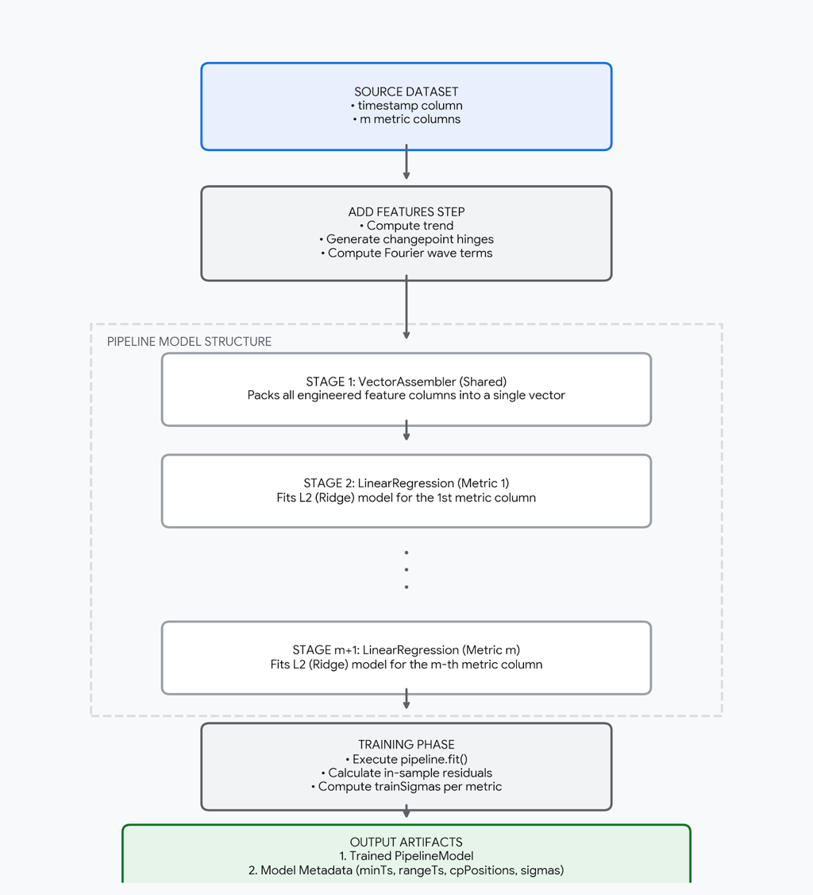

# Helter Skelter — Architecture & API Reference

## Overview

Helter Skelter is designed as a **distributed, JVM-native forecasting engine** optimized for Apache Spark.

Its architecture enforces a strict separation between:

- **Batch Training (offline)**
- **Runtime Prediction (online / real-time)**

---

## High-Level Architecture

### Core Design Principles

#### 1. Single Feature Vector

All transformations (trend + seasonalities) are computed **once** into a shared vector.

- Same feature matrix for all metrics
- Different regression weights per metric

👉 This enables **multi-metric scoring in one pass**

#### 2. Batch vs Runtime Separation

| Phase | Responsibility |
|------|---------------|
| Batch Training | Learn model parameters |
| Runtime Prediction | Apply model to new data |

---

## Batch Training Phase

Executed periodically (e.g. daily or weekly Spark job).



### Steps

#### 1. Time Normalization

All timestamps are converted to **hours**

#### 2. Changepoint Generation

- Uniformly distributed across the time range
- Define where trend slope can change

#### 3. Feature Vector Construction

Features include:

- Trend
- Changepoint hinge functions
- Fourier seasonalities:
    - Hourly
    - Weekly
    - Monthly
    - Yearly

#### 4. Multi-Metric Regression

For each metric m:

$y_m = X w_m$

- Shared feature matrix X
- Independent coefficient vector $w_m$

All regressions use:

- **Ridge regression (L2)**

#### 5. Residual Analysis

For each metric:

$r_m = y_m - \hat{y}_m$

$\sigma_m = std(r_m)$

#### 6. Model & Metadata Storage (optional)

Model and metadata can be persisted for future prediction

---

## Predict phase

Executed real-time

### Steps

#### 1. Model load

Loads the static PipelineModel and the metadata

#### 2. Time Scaling Continuity

Uses the exact minTs and rangeTs saved from training to ensure new timestamps are scaled using the same reference points

#### 3. Single-Pass Forecasting

Applies the shared vector pipeline to calculate predictions for all metrics, processing entire data rows in a single step

#### 4. Real-Time Anomaly Scoring

Computes Z-scores and compare them against the threshold to catch outliers on the fly

---

## API Reference

### Model Classes

#### `HSConfig`

Configuration parameters for the model. All fields have defaults and can be overridden.

```scala
case class HSConfig(
  fourierOrderHourly  : Int = 4,  // Fourier terms for hourly seasonality  (period 24h)
  fourierOrderWeekly  : Int = 3,  // Fourier terms for weekly seasonality   (period 168h)
  fourierOrderMonthly : Int = 5,  // Fourier terms for monthly seasonality  (period 720.5h)
  fourierOrderYearly  : Int = 8,  // Fourier terms for yearly seasonality   (period 8766h)
  nChangepoints       : Int = 9   // Number of equidistant changepoints in the training period
)
```

| Parameter | Type | Default | Description |
|-----------|------|---------|-------------|
| `fourierOrderHourly` | `Int` | `4` | Number of Fourier harmonics for the 24h cycle (morning/evening peaks) |
| `fourierOrderWeekly` | `Int` | `3` | Number of Fourier harmonics for the 168h cycle (weekday vs weekend) |
| `fourierOrderMonthly` | `Int` | `5` | Number of Fourier harmonics for the ≈720.5h cycle (monthly pattern) |
| `fourierOrderYearly` | `Int` | `8` | Number of Fourier harmonics for the 8766h cycle (summer vs winter) |
| `nChangepoints` | `Int` | `9` | Number of piecewise trend breakpoints, placed equidistantly in the training range |

---

#### `HSModel`

Container returned by `fit()` and accepted by `predict()`. Holds the trained pipeline and all metadata needed for scoring.

```scala
case class HSModel(
  model : PipelineModel, // Spark ML Pipeline (VectorAssembler + one LinearRegressionModel per metric)
  meta  : HSMeta         // Training parameters and per-metric sigmas
)
```

---

#### `HSMeta`

Training metadata persisted alongside the model. You do not create this manually — it is produced by `fit()` and loaded by `HSModelStore.load()`.

| Field | Type | Description |
|-------|------|-------------|
| `minTs` | `Double` | First training timestamp in hours from Unix epoch (normalization anchor) |
| `rangeTs` | `Double` | Duration of the training set in hours (normalization scale) |
| `trainSigmas` | `Map[String, Double]` | Per-metric standard deviation of in-sample residuals (used to compute z-scores) |
| `cpPositions` | `Seq[Double]` | Changepoint positions in hours from Unix epoch |
| `fourierOrderHourly` | `Int` | Fourier order used during training |
| `fourierOrderWeekly` | `Int` | Fourier order used during training |
| `fourierOrderMonthly` | `Int` | Fourier order used during training |
| `fourierOrderYearly` | `Int` | Fourier order used during training |

---

### Phase 1 — Training (fit)

#### `HelterSkelter.fit()`

Trains one Ridge regression per metric on the historical DataFrame. Returns an `HSModel`.

```scala
def fit(
  historicDf : DataFrame,
  valueCols  : Set[String],
  config     : HSConfig = HSConfig()
): HSModel
```

| Parameter | Type | Required | Description |
|-----------|------|----------|-------------|
| `historicDf` | `DataFrame` | ✅ | Historical data. Must contain a `timestamp` column and all columns listed in `valueCols` |
| `valueCols` | `Set[String]` | ✅ | Names of the numeric metric columns to model (e.g. `Set("bookings", "searches")`) |
| `config` | `HSConfig` | ❌ | Hyper-parameters — defaults to `HSConfig()` |

**Supported `timestamp` column types:**

| Type | Interpretation |
|------|---------------|
| `TimestampType` / `DateType` | Native Spark timestamp |
| `StringType` | Parsed as `yyyy-MM-dd HH:mm:ss` |
| `LongType` / `IntegerType` | Unix epoch **seconds** |

**Returns:** `HSModel`

---

#### `HelterSkelter.fitAndStore()`

Convenience method — trains the model and immediately persists it to storage in one call.

```scala
def fitAndStore(
  historicDf : DataFrame,
  modelPath  : String,
  valueCols  : Set[String],
  config     : HSConfig = HSConfig()
)(implicit spark: SparkSession): HSModel
```

| Parameter | Type | Required | Description |
|-----------|------|----------|-------------|
| `historicDf` | `DataFrame` | ✅ | Same as `fit()` |
| `modelPath` | `String` | ✅ | Storage path for the model (e.g. `"s3://my-bucket/hs-model"`) |
| `valueCols` | `Set[String]` | ✅ | Same as `fit()` |
| `config` | `HSConfig` | ❌ | Same as `fit()` |

**Returns:** `HSModel`

---

#### `HSModelStore.store()`

Saves an `HSModel` (Spark `PipelineModel` + `HSMeta`) to persistent storage.

```scala
def store(model: HSModel, modelPath: String)(implicit spark: SparkSession): Unit
```

| Parameter | Type | Description |
|-----------|------|-------------|
| `model` | `HSModel` | Trained model to persist |
| `modelPath` | `String` | Root path; the pipeline is saved under `{modelPath}/model` and the metadata under `{modelPath}/meta` |

---

### Phase 2 — Scoring (predict)

#### `HelterSkelter.predict()`

Scores a DataFrame using a previously trained `HSModel`. Appends anomaly-detection columns for each metric. Never accesses historical data — all normalization anchors come from `HSModel.meta`.

```scala
def predict(
  model     : HSModel,
  df        : DataFrame,
  valueCols : Set[String],
  threshold : Double = 2.5
): DataFrame
```

| Parameter | Type | Required | Description |
|-----------|------|----------|-------------|
| `model` | `HSModel` | ✅ | Trained model returned by `fit()` or loaded via `HSModelStore.load()` |
| `df` | `DataFrame` | ✅ | Data to score. Must contain a `timestamp` column and all columns in `valueCols` |
| `valueCols` | `Set[String]` | ✅ | Metrics to score — must be a subset of the columns the model was trained on |
| `threshold` | `Double` | ❌ | Z-score threshold for anomaly classification (default `2.5`; must be `> 0`) |

**Output columns** — for each metric `X`, the following columns are appended:

| Column | Type | Description                                                       |
|--------|------|-------------------------------------------------------------------|
| `X_forecast` | `Double` | Predicted baseline value (rounded to 1 decimal)                   |
| `X_residual` | `Double` | Observed − forecast (rounded to 1 decimal)                        |
| `X_z_score` | `Double` | Residual / training sigma (rounded to 2 decimals)                 |
| `X_pct_deviation` | `Double` | `(observed − forecast) / forecast × 100` (null when forecast ≈ 0) |
| `X_is_anomaly` | `Boolean` | `true` if `\|z_score\| > threshold`                               |
| `X_severity` | `String` | `HIGH` / `MEDIUM` / `LOW` / `OK` (see table below)                |
| `X_minForecast` | `Double` | Lower bound of expected range: `forecast − threshold × sigma`     |
| `X_maxForecast` | `Double` | Upper bound of expected range: `forecast + threshold × sigma`     |

**Severity classification:**

| Condition | Severity      |
|-----------|---------------|
| $\| z\| > 2 \cdot T$ | `HIGH`        |
| $\| z\| > 1.5 \cdot T$ | `MEDIUM`      |
| $\| z\| > T$ | `LOW`         |
| otherwise | `OK`          |

**Returns:** the input `DataFrame` with all original columns preserved plus the output columns above.

---

#### `HelterSkelter.loadAndPredict()`

Convenience method — loads the model from storage and scores in one call. Prefer calling `HSModelStore.load()` once and reusing the `HSModel` when scoring multiple DataFrames.

```scala
def loadAndPredict(
  modelPath : String,
  df        : DataFrame,
  valueCols : Set[String],
  threshold : Double = 2.5
)(implicit spark: SparkSession): DataFrame
```

| Parameter | Type | Required | Description |
|-----------|------|----------|-------------|
| `modelPath` | `String` | ✅ | Path where the model was previously saved |
| `df` | `DataFrame` | ✅ | Same as `predict()` |
| `valueCols` | `Set[String]` | ✅ | Same as `predict()` |
| `threshold` | `Double` | ❌ | Same as `predict()` |

---

#### `HSModelStore.load()`

Loads a saved `HSModel` (Spark `PipelineModel` + `HSMeta`) from persistent storage.

```scala
def load(modelPath: String)(implicit spark: SparkSession): HSModel
```

| Parameter | Type | Description |
|-----------|------|-------------|
| `modelPath` | `String` | Root path used when `store()` was called |

**Returns:** `HSModel`  
**Throws:** `ModelException` if the model or metadata cannot be read from the given path.
